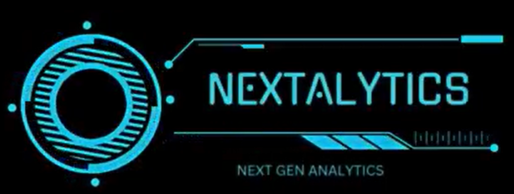

#  Next Generation Visual Analytics Dashboard
An interactive, user-friendly biomedical data dashboard designed to automate complex data analysis and visualization tasks for biomedical research. This dashboard integrates data preprocessing, exploratory analysis, visualization, dimensionality reduction, machine learning modeling, image segmentation, and a conversational AI assistant.

## About The Dashboard:

Next Generation Visual Analytics is a comprehensive Streamlit application that accelerates biomedical research by combining:
#### Data Preprocessing: Missing value handling, outlier detection, duplicates removal, transformations.

